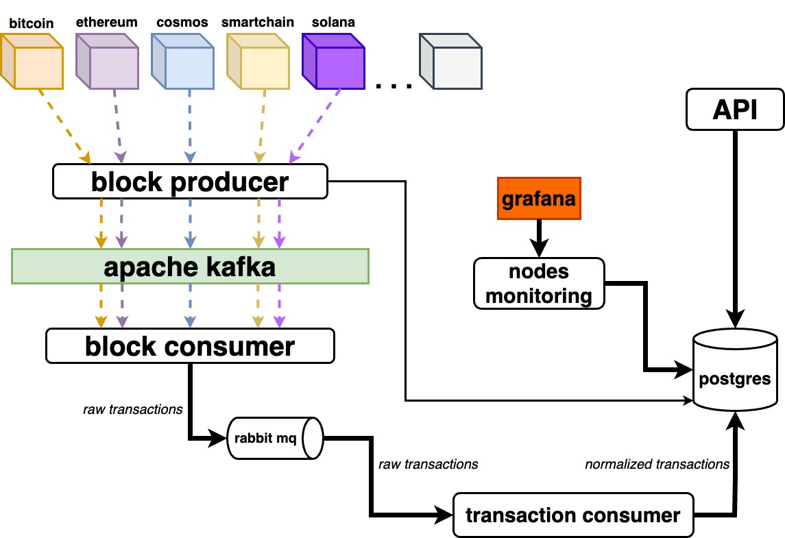

# blockchain-indexer

## Overview

Blockchain Indexer provides fast transaction indexing that can be used in explorers, crypto wallets, etc. It supports transaction parsing of the most popular blockchains: Bitcoin, Ethereum, Smartchain, Cosmos, Solana, Binance, and Near.

## Architecture

- **Block producer** fetches blocks one by one from nodes of different blockchains and then it sends raw block data to Kafka using a separate Kafka topic for each blockchain. Writing a block to Kafka allows you to store all nodes' data in Kafka starting from the first block to the latest block. If we need to re-parse and re-normalize block data again, we can just read it from Kafka again very efficiently instead of fetching blocks from nodes again which takes a lot of time.

- **Block consumer** gets blocks by reading Kafka messages from each topic and sends block data to Rabbiq MQ exchange (fanout mode). For now, we have only one queue for saving transactions in the database. Later, it's planned to add more queues for different purposes like notifications, post-handling, etc.
One instance of Block consumer creates 1 Kafka consumer group with 1 Kafka consumer for each topic (for each blockchain). To scale block consuming, you need to add more Block consumer instances, which will add more Kafka consumers to Kafka consumer groups.

- **Transaction consumer** is a worker that consumes blocks from Rabbit queue to parse and normalize transactions and then it puts normalized transactions to Postgres.

- **API** is a simple REST API web server to give transaction data to users.

- **Nodes monitoring** retrieves the list of nodes from the database for every blockchain and collects some metrics about a current block, node version, latency, etc.

<p align="center"></p>

## Local run

```shell
docker-compose up
```

## URLs

- [Swagger](http://localhost:8420/docs/index.html)
- [Grafana](http://localhost:3000)
- [Prometheus](http://localhost:9090)
- [Push Gateway](http://localhost:9091)
- [Rabbit MQ](http://localhost:15672)

## TODO

- Add block producer (kafka) ✅
- Add block consumer (kafka) ✅
- Add metrics ✅
- Add Postgres ✅
- Add nodes monitoring ✅
- Add nodes backup mechanism ✅
- Add queues with RabbitMQ for workers: Worker that saves txs in Postgres ✅
- Add API ✅
- Check if consumers are scalable ✅
- Add more chains (fix Binance, add Solana, Bitcoin)
