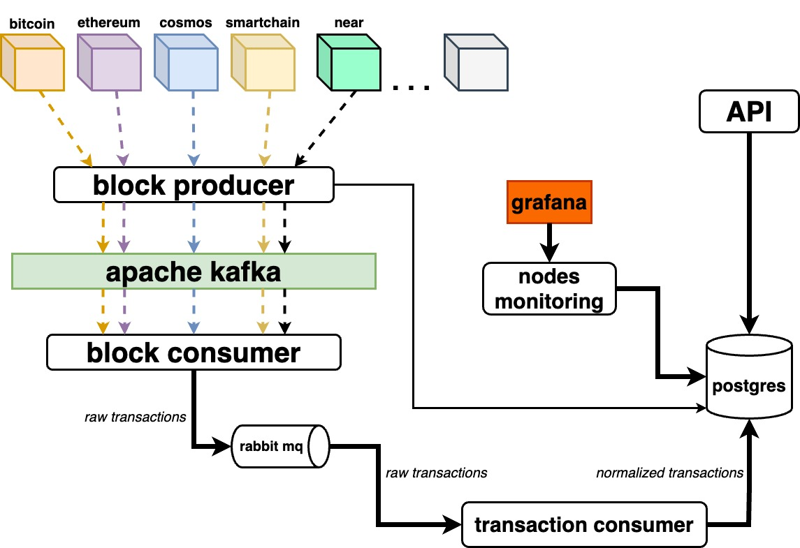

# blockchain-indexer

## Overview

Blockchain Indexer supports transactions parsing of the most popular blockchains: Bitcoin, Ethereum, Smartchain, Cosmos, Solana, Binance and Near.

## Architecture

<p align="center"></p>

## Local run

```shell
docker-compose up
```

## URLs

- [Swagger](http://localhost:8420/docs/index.html)
- [Grafana](http://localhost:3000)
- [Prometheus](http://localhost:9090)
- [Push Gateway](http://localhost:9091)
- [Rabbit MQ](http://localhost:15672)

## TODO

- Add block producer (kafka) ✅
- Add block consumer (kafka) ✅
- Add metrics ✅
- Add Postgres ✅
- Add nodes monitoring ✅
- Add nodes backup mechanism ✅
- Add queues with RabbitMQ for workers: Worker that saves txs in Postgres ✅
- Add API ✅
- Draw a diagram of the architecture ✅
- Update README.md (Add arch description)
- Check if consumers are scalable
- Add more chains (fix Binance, add Solana, Bitcoin and Near-check if there are public nodes)
